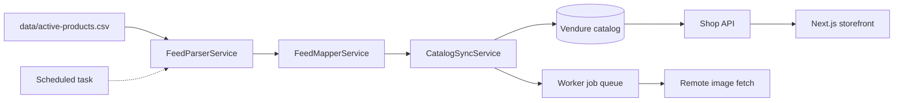

# Product feed import — plan index

Import `data/active-products.csv` (1on1wholesale-style wholesale feed) into the bsk Vendure catalog, with native **product variants** for grouped SKUs and **facets** (including **Body Fit**) for descriptive attributes.

## Context

| Item | Detail |
|------|--------|
| Source file | `data/active-products.csv` |
| Row count | ~1,064 product rows (~12k file lines due to multiline HTML descriptions) |
| Encoding | Latin-1 / Windows-1252 → normalise to UTF-8 on import |
| Platform | Vendure 3.7.1 (`apps/server`) + Next.js storefront (`apps/storefront`) |
| Implementation | Custom `ProductFeedImportPlugin` — not Vendure's native CSV format |

## Architecture (high level)

## Phases

| Phase | Document | Outcome |
|-------|----------|---------|
| 1 | [phase-1-taxonomy-and-schema.md](./phase-1-taxonomy-and-schema.md) | Facets, collections, custom fields, migrations |
| 2 | [phase-2-feed-parser-and-mapper.md](./phase-2-feed-parser-and-mapper.md) | Parse CSV → normalised product/variant model |
| 3 | [phase-3-import-plugin-and-initial-load.md](./phase-3-import-plugin-and-initial-load.md) | Plugin, admin trigger, first catalog populate |
| 4 | [phase-4-storefront-integration.md](./phase-4-storefront-integration.md) | Nav, filters, PDP display |
| 5 | [phase-5-ongoing-sync-and-assets.md](./phase-5-ongoing-sync-and-assets.md) | Delta sync, asset queue, cache revalidation |

## Reference

| Document | Contents |
|----------|----------|
| [feed-structure-and-mapping.md](./feed-structure-and-mapping.md) | Column analysis, Vendure mapping, variant grouping rules |
| [decisions.md](./decisions.md) | Body Fit, trade price, out-of-stock, open questions |

## Decisions locked in

- **Variants:** Use Vendure native option groups + `ProductVariant` for rows grouped by `Product Code` / `Subproduct Code`.
- **Size field:** Map `Size (met)` to facet **Body Fit** — not variant options. Add separate facets (e.g. cup/waist) when standardized sizing arrives.
- **Retail price:** `RRP` → variant price. `Trade Price` → admin custom field only (unless B2B later).
- **Transform required:** Feed format ≠ Vendure built-in CSV import format.

## Out of scope (for now)

- Tiered pricing / promotions from `all_cats` tags
- B2B trade-price storefront display
- Manual Dashboard product entry

## Testing

Vendure testing scaffold in `apps/server` ([Vendure testing guide](https://github.com/vendurehq/vendure/tree/master/docs/docs/guides/developer-guide/testing)):

| Layer | When | Command |
|-------|------|---------|
| Unit (`*.spec.ts`) | Phase 2+ parser/mapper/constants | `npm run test:server` |
| E2E (`*.e2e-spec.ts`) | Phase 3+ import/sync | `npm run test:server:e2e` |

Phase 1 includes sample unit tests for taxonomy constants and an e2e test verifying facet seed on plugin bootstrap.
