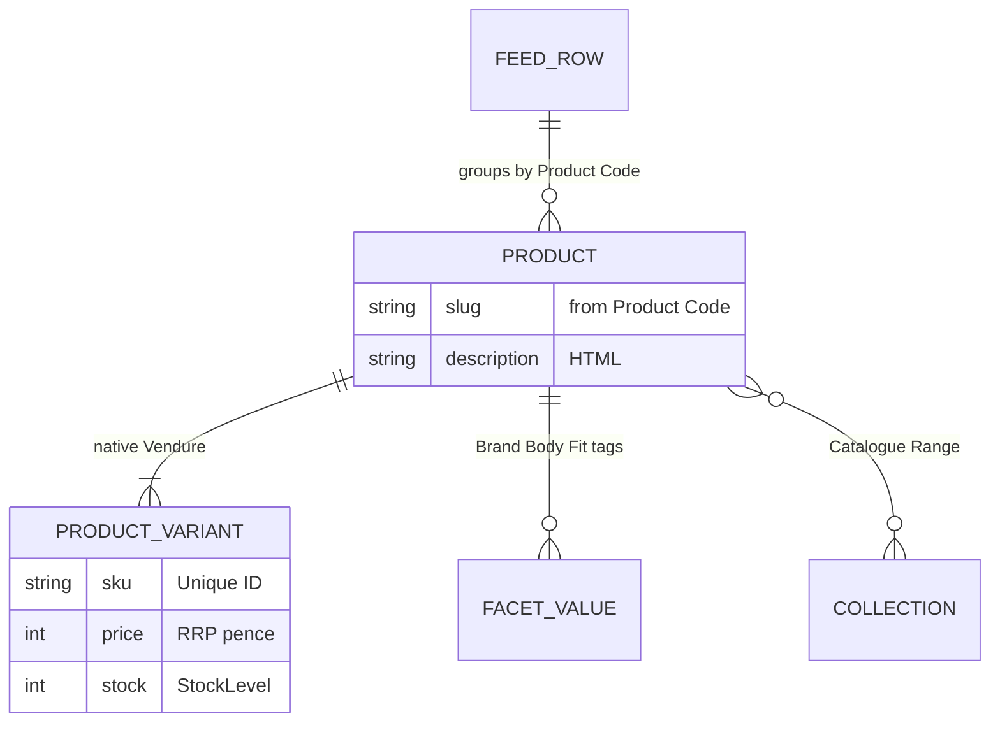
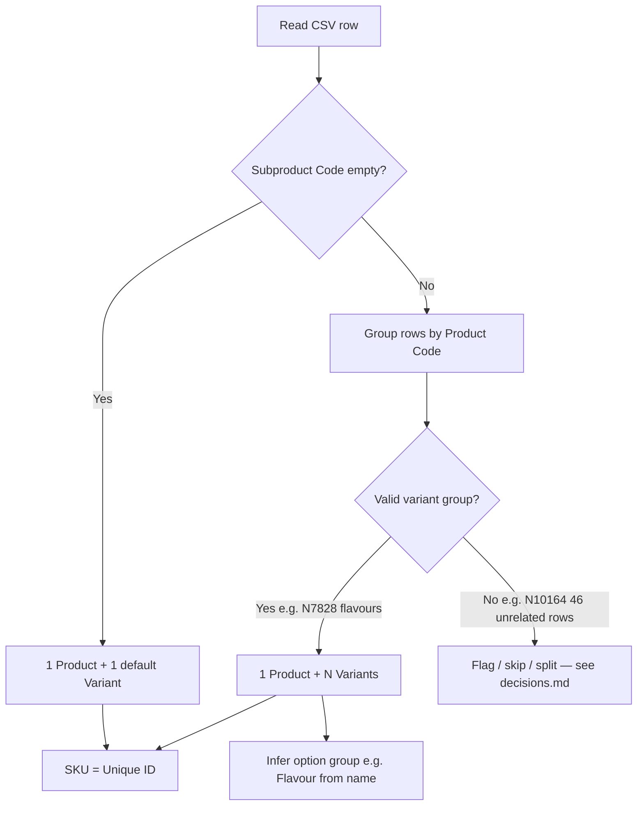

# Feed structure and Vendure mapping

Source: `data/active-products.csv`

## Feed statistics

| Metric | Value |
|--------|-------|
| Data rows | 1,064 |
| File lines | ~12,253 (multiline `Description` fields) |
| Encoding | Latin-1 — convert to UTF-8 before processing |
| Single-SKU rows | 933 (`Unique ID` = `Product Code`, empty `Subproduct Code`) |
| Multi-variant groups | 27 `Product Code`s → 131 variant rows |
| In stock / out of stock | 881 / 183 |
| HTML descriptions | 857 rows |
| Multiple images | 958 rows (`AllImages` pipe-separated URLs) |
| `all_cats` tags | 87 unique values |
| RRP range | £2.49 – £548.99 |

## Columns (26)

```
Unique ID, Product Code, Subproduct Code, Product Name, Description, materials,
Size (imp), Size (met), Power, Trade Price, RRP, Catalogue, Range,
ImageName, ThumbImageURL, ViewImageURL, Hi-Res URL, Stock, StockLevel,
MPN, Manufacturer, Barcode, all_cats, wieght, AllImages, Short Unique
```

## Entity mapping



## Column → Vendure mapping

| Feed column | Vendure target | Level | Notes |
|-------------|----------------|-------|-------|
| `Product Code` | Product slug / external ref | Product | Grouping key for variants |
| `Unique ID` | Variant SKU | Variant | Stable key for delta sync |
| `Subproduct Code` | Part of SKU + option value | Variant | Empty = single-variant product |
| `Product Name` | Product name; variant label suffix | Both | Derive option value from suffix when grouped |
| `Description` | Product description | Product | HTML; sanitise or trusted render on storefront |
| `RRP` | Variant price | Variant | Shop-facing retail price |
| `Trade Price` | Custom field `tradePrice` | Variant | Admin only |
| `StockLevel` | `stockOnHand` | Variant | Parse integer; handle decimals |
| `Stock` | Enabled / availability | Variant | `Out Stock` → 0 stock or disabled |
| `Barcode` | Custom field | Variant | EAN |
| `MPN` | Custom field | Variant | |
| `Manufacturer` | Facet **Brand** | Product | |
| `Size (met)` | Facet **Body Fit** | Product | Descriptive fit/dimensions — not variant options |
| `Size (imp)` | Custom field (optional) | Product | Keep for reference; storefront uses metric |
| `materials` | Custom field | Product | |
| `Power` | Custom field | Product | |
| `wieght` | Custom field `weight` | Variant | Shipping weight |
| `all_cats` | Facets (pipe-separated) | Product | e.g. `Anal Toys`, `New In`, `Offers` |
| `Catalogue` | Collection (top-level) | Product | 19 values |
| `Range` | Collection (child) or facet | Product | 55 values |
| `AllImages` | Assets (HTTP import) | Product / Variant | First = featured; rest = gallery |

Redundant image columns (`ThumbImageURL`, `ViewImageURL`, `Hi-Res URL`, `ImageName`) — ignore if `AllImages` is present.

## Variant grouping rules



### Good variant groups (example: N7828)

| Unique ID | Subproduct Code | Product Name suffix | RRP | Stock |
|-----------|-----------------|---------------------|-----|-------|
| N7828 NS5629 | NS5629 | Watermelon | 19.99 | 24 |
| N7828 NS5630 | NS5630 | Vanilla | 19.99 | 15 |
| N7828 NS5631 | NS5631 | Cherry | 19.99 | 88 |
| N7828 NS5632 | NS5632 | Strawberry | 19.99 | 31 |

→ One product, option group **Flavour**, four variants. Shared description and `AllImages` at product level.

### Single-SKU rows (933 rows)

`Unique ID` = `Product Code`, no `Subproduct Code` → one product with one default variant (standard Vendure pattern).

### Body Fit and variants

`Size (met)` does **not** vary within variant groups in the current feed (0 groups with differing size). Store on the **product** as facet **Body Fit**, not as an option group.

## Data quality flags

| Issue | Impact | Mitigation |
|-------|--------|------------|
| Latin-1 encoding | Parse errors | UTF-8 normalisation step |
| HTML in descriptions | XSS / layout | Sanitise or controlled HTML component |
| 528 unique Body Fit values | Weak filtering | Display on PDP; normalise common values for facets later |
| N10164-style groups (46 rows, missing RRP/images) | Bad grouping | Exception rules — see [decisions.md](./decisions.md) |
| Shared `AllImages` across variants | Wrong variant image | Product gallery + variant image where filename matches `Subproduct Code` |
| `Tiered Pricing` in `all_cats` | Not auto-importable | Out of scope; promotions plugin later |

## Not compatible with Vendure native CSV import

Vendure's built-in format expects columns such as `name`, `slug`, `optionGroups`, `optionValues`, `sku`, `price`, with empty `name` on continuation rows. This feed requires a **transform layer** (Phase 2–3).

Reference: [Vendure importing data](https://github.com/vendurehq/vendure/tree/master/docs/docs/guides/developer-guide/importing-data)
