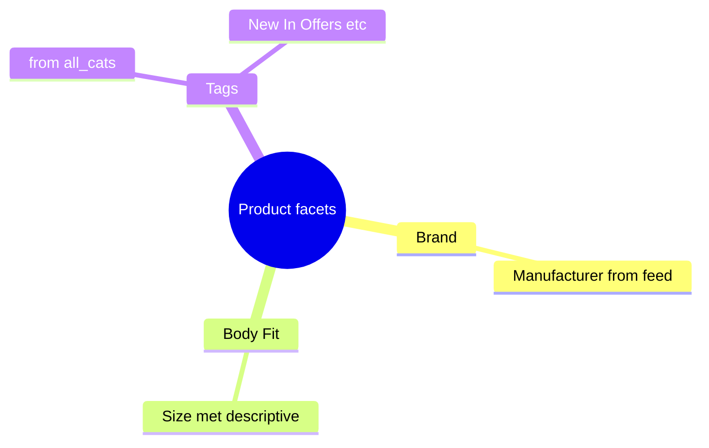
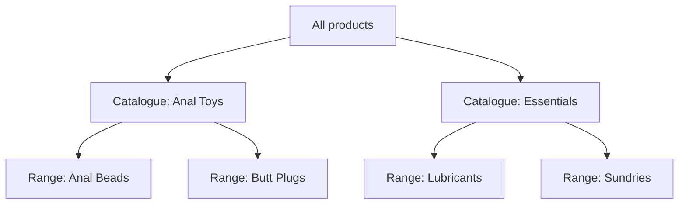

# Phase 1 — Taxonomy and schema

Define how feed data maps onto Vendure catalog structures before writing import code.

## Goals

- Facets, collections, and custom fields defined in a plugin
- Database migration generated and applied
- Taxonomy documented for merchandising and storefront nav

## Deliverables

- [ ] `ProductFeedImportPlugin` scaffold (minimal — config + custom fields only)
- [ ] Facet definitions (Brand, Body Fit, + tags from `all_cats`)
- [ ] Collection structure (Catalogue → Range)
- [ ] Custom fields on Product and ProductVariant
- [ ] Migration committed to `apps/server/src/migrations/`

## Facet design



| Facet | Code (suggested) | Source | Filter on storefront? |
|-------|------------------|--------|------------------------|
| Brand | `brand` | `Manufacturer` | Yes |
| Body Fit | `body-fit` | `Size (met)` | Optional (normalise later) |
| Category tags | `category` or per-tag facets | `all_cats` | Yes |
| Range | `range` | `Range` | Optional if using collections for nav |

**Body Fit:** product-level, one value per product. Values are free-text from feed (~528 unique). Prioritise PDP display; add normalised filter values (e.g. `One Size`) incrementally.

## Collection design



| Feed field | Vendure | Count (approx) |
|------------|---------|----------------|
| `Catalogue` | Parent collection | 19 |
| `Range` | Child collection under Catalogue | 55 |

Products can belong to multiple collections if `all_cats` implies cross-listing — decide per tag in Phase 2 mapper rules.

## Custom fields

### Product

| Name | Type | Source |
|------|------|--------|
| `sourceProductCode` | string | `Product Code` |
| `materials` | string | `materials` |
| `power` | string | `Power` |
| `sizeImperial` | string | `Size (imp)` (optional) |

### ProductVariant

| Name | Type | Source |
|------|------|--------|
| `sourceUniqueId` | string | `Unique ID` |
| `tradePrice` | float | `Trade Price` |
| `barcode` | string | `Barcode` |
| `mpn` | string | `MPN` |
| `weight` | float | `wieght` |

## Plugin configuration sketch

Custom fields live in [`vendure-config.ts`](../../../apps/server/src/vendure-config.ts) — see [`custom-fields.ts`](../../../apps/server/src/custom-fields.ts). The plugin handles taxonomy seed only.

## Migration

```bash
cd apps/server
npx vendure migrate product-feed-import
```

Commit migration; verify `synchronize: false` — schema changes only via migrations.

## Acceptance criteria

- Server starts with plugin registered in `vendure-config.ts`
- Custom fields visible in Admin API / Dashboard
- Facet and collection strategy agreed (see [decisions.md](./decisions.md))
- No import logic yet — schema and taxonomy only

## Next phase

[Phase 2 — Feed parser and mapper](./phase-2-feed-parser-and-mapper.md)
