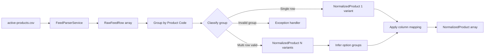
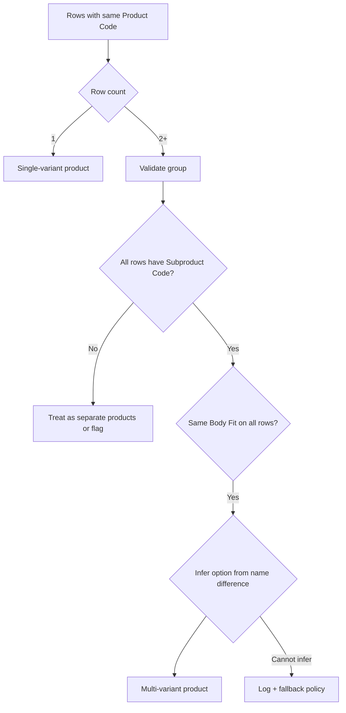

# Phase 2 — Feed parser and mapper

Parse `data/active-products.csv` into a normalised in-memory model ready for Vendure catalog writes.

## Goals

- Robust CSV parsing (multiline fields, Latin-1 → UTF-8)
- Group rows into products and variants
- Map columns to taxonomy decisions from Phase 1
- Unit-testable without hitting the database

## Deliverables

- [ ] `FeedParserService` — read and validate CSV
- [ ] `FeedMapperService` — rows → `NormalizedProduct[]`
- [ ] `NormalizedProduct` / `NormalizedVariant` types
- [ ] Variant grouping + option-group inference
- [ ] Tests with fixture rows (single SKU, N7828-style group, edge cases)

## Pipeline



## Normalised model (sketch)

```ts
interface NormalizedVariant {
    sku: string;              // Unique ID
    subproductCode: string;
    name: string;             // full Product Name
    optionValues: Record<string, string>; // e.g. { Flavour: 'Cherry' }
    price: number;            // RRP in major units → convert to cents in sync
    stockOnHand: number;
    inStock: boolean;
    barcode?: string;
    mpn?: string;
    tradePrice?: number;
    weight?: number;
    variantAssetUrls?: string[]; // optional per-variant images
}

interface NormalizedProduct {
    productCode: string;
    slug: string;
    name: string;             // base product name
    description: string;
    bodyFit?: string;         // → Body Fit facet
    brand?: string;
    materials?: string;
    power?: string;
    sizeImperial?: string;
    facets: string[];         // from all_cats
    catalogue?: string;
    range?: string;
    assetUrls: string[];      // from AllImages
    optionGroups: string[];   // e.g. ['Flavour']
    variants: NormalizedVariant[];
}
```

## Parser requirements

| Concern | Approach |
|---------|----------|
| Encoding | Read as Latin-1, normalise to UTF-8 strings |
| Multiline fields | Proper CSV parser (not line-split) |
| HTML in description | Pass through; sanitise in Phase 3 sync or here |
| Empty RRP | Reject variant or skip product — log warning |
| `StockLevel` decimals | `Math.floor` or round — document choice |
| Missing `AllImages` | Fallback to `ViewImageURL` or skip assets |

## Variant grouping algorithm



### Option group inference

1. Compare variant `Product Name` values — extract differing suffix (e.g. after last `-`)
2. Default option group name: **Flavour** (configurable constant)
3. If size differed in future feeds → add **Size** option group (separate from Body Fit facet)

## Body Fit handling

- Read `Size (met)` from first row in group (constant across variants today)
- Attach to `NormalizedProduct.bodyFit`
- Do **not** add to `optionValues`

## Exception groups

Products like `N10164` (46 rows, missing prices/images) — apply policy from [decisions.md](./decisions.md):

- Recommended: emit 46 separate single-variant products + warning log
- Alternative: skip entire group + report

## Testing fixtures

| Fixture | Expect |
|---------|--------|
| N8440 | 1 product, 1 variant, Body Fit = `32cm length` |
| N7828 | 1 product, 4 variants, option Flavour |
| N9917 | 1 product, 6 variants, shared images |
| Out of stock row | `inStock: false`, stock 0 |

## Acceptance criteria

- Parser handles full `active-products.csv` without crash
- Mapper output count documented (products vs variants)
- Edge-case report generated (bad groups, missing RRP, etc.)
- No Vendure DB writes in this phase

## Next phase

[Phase 3 — Import plugin and initial load](./phase-3-import-plugin-and-initial-load.md)
