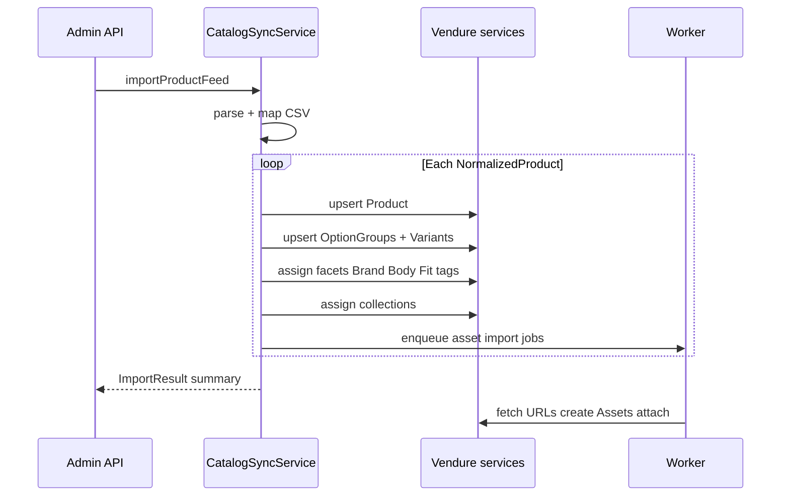

# Phase 3 — Import plugin and initial catalog load

Write normalized products into Vendure via services; run first full import.

## Goals

- `CatalogSyncService` upserts products, variants, facets, collections
- Admin API to trigger import (and optional CLI script)
- Full load of `active-products.csv` into dev/staging

## Deliverables

- [ ] `CatalogSyncService` — Vendure write path
- [ ] `AssetImportService` — queue or inline remote image fetch
- [ ] Admin mutation `importProductFeed` (and/or `runProductFeedImport` job)
- [ ] Stand-alone script for local bootstrap
- [ ] Import runbook (commands, expected duration, rollback notes)
- [ ] Initial catalog populated in dev

## Plugin structure

```
apps/server/src/plugins/product-feed-import/
├── product-feed-import.plugin.ts
├── types.ts
├── constants.ts
├── services/
│   ├── feed-parser.service.ts
│   ├── feed-mapper.service.ts
│   ├── catalog-sync.service.ts
│   └── asset-import.service.ts
├── api/
│   ├── api-extensions.ts
│   └── product-feed-import.resolver.ts
└── types/
    └── normalized-product.ts
```

Register in `vendure-config.ts`:

```ts
ProductFeedImportPlugin.init({
    feedPath: path.join(__dirname, '../../../data/active-products.csv'),
}),
```

Env via config only — not `process.env` inside services.

## Sync flow



## Vendure services to use

| Operation | Service |
|-----------|---------|
| Create/update product | `ProductService` |
| Variants, options | `ProductVariantService`, option group APIs |
| Facets | `FacetService`, `FacetValueService` |
| Collections | `CollectionService` |
| Stock | `StockMovementService` or variant update |
| Assets | `AssetService` + remote URL import |

Always pass `RequestContext` — create admin context for stand-alone import script.

## Upsert strategy

| Entity | Match key | Action |
|--------|-----------|--------|
| Product | `customFields.sourceProductCode` or slug | create or update |
| Variant | SKU (`Unique ID`) | create or update price/stock |
| Facet values | facet code + value name | find or create |
| Collections | slug from Catalogue/Range | find or create |

## Assets (Phase 3 scope)

**Minimal:** synchronous import for first N products in dev.

**Preferred:** enqueue worker jobs per product (full implementation in Phase 5).

- Parse `AllImages` pipe-separated URLs
- First URL → `featuredAsset`
- Match variant-specific filename to `Subproduct Code` when possible

## Admin API (sketch)

```graphql
extend type Mutation {
    importProductFeed: ProductFeedImportResult!
}

type ProductFeedImportResult {
    productsCreated: Int!
    productsUpdated: Int!
    variantsCreated: Int!
    variantsUpdated: Int!
    errors: [String!]!
    warnings: [String!]!
}
```

Resolver: `@Allow(Permission.SuperAdmin)`, `@Transaction()`.

## CLI bootstrap (sketch)

```bash
cd apps/server
npx ts-node src/plugins/product-feed-import/scripts/run-import.ts
```

Uses `populate`-style bootstrap with admin `RequestContext`.

## Import runbook notes

- Run on empty DB or idempotent upsert — document which
- ~1,064 rows, ~958 with images — expect long first run if assets synchronous
- Re-run safe if upsert keys stable
- `npm run build:server` after plugin changes

## Acceptance criteria

- Dev server catalog matches feed counts (products/variants documented)
- Sample products verifiable in Dashboard and Shop API
- Brand, Body Fit, and tag facets assigned
- Collections navigable in Admin
- Import summary returned with warnings for edge cases

## Next phase

[Phase 4 — Storefront integration](./phase-4-storefront-integration.md)
