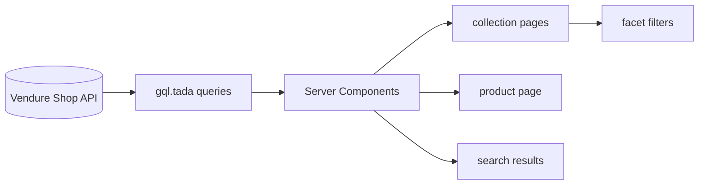
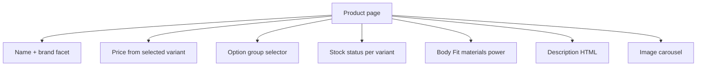

# Phase 4 — Storefront integration

Expose imported catalog through the existing Next.js storefront — collections, facets, variants, and PDP specs.

## Goals

- Collection pages reflect `Catalogue` / `Range` hierarchy
- Facet filters include Brand, tags, and optionally Body Fit
- Product pages support variant selection (option groups)
- Body Fit and specs visible on PDP

## Prerequisites

- Phase 3 complete — catalog in Vendure Shop API
- Sample products verified via GraphiQL

## Deliverables

- [ ] GraphQL fragments/queries for new facets and custom fields (if needed)
- [ ] Navbar/collections aligned with imported hierarchy
- [ ] Facet filter UI includes Brand (+ tags as agreed)
- [ ] PDP: variant picker, Body Fit, materials, brand
- [ ] HTML description rendering (sanitised)
- [ ] i18n keys for new labels (`Body Fit`, etc.) — `en.json` / `de.json`

## Data flow



Storefront work stays in `apps/storefront/` — no changes to import plugin except documented GraphQL shape.

## Collection navigation

| Source | Storefront |
|--------|------------|
| Vendure collections | `/collection/[slug]` (existing route) |
| Navbar collections | `navbar-collections` — may need menu config or fetch top-level collections |

Verify slugs generated at import match URL expectations (lowercase, hyphenated).

## Facet filters

Existing: `facet-filters.tsx`, collection/search pages.

| Facet | Show in filter UI? | Priority |
|-------|-------------------|----------|
| Brand | Yes | High |
| Tags from `all_cats` | Yes | High |
| Body Fit | Optional v1 | Low — many unique values |
| Range | If not using collection nav | Medium |

Start with Brand + key category tags; add Body Fit filters when values are normalised.

## Product detail page



### Variant selector

Use existing `product-info.tsx` / variant patterns — Vendure returns `options` + `variants` on `Product`.

Map selected option combination → variant ID for add-to-cart.

### Body Fit display

- Query facet value or product custom field
- Label: **Body Fit** (i18n: `product.bodyFit`)
- Render as spec row, not as variant dropdown

### Description HTML

If sanitised at import: render with controlled component. If not: use sanitiser at render (e.g. DOMPurify server-side or restrict allowed tags).

## GraphQL additions (coordinate with server)

Extend product fragment if custom fields not yet queried:

```graphql
# Example — align with actual schema after Phase 1
customFields {
    materials
    power
}
facetValues {
    name
    facet { code name }
}
```

Document final shape in plugin README for storefront agent.

## Search

Default search plugin indexes product name/description — verify imported products appear in `/search`.

## Acceptance criteria

- Browse collection → see imported products
- Filter by Brand works
- Multi-variant product: select flavour → price/stock/SKU update
- Single-variant product: add to cart without selector noise
- Body Fit visible on PDP
- No hardcoded feed data in storefront

## Next phase

[Phase 5 — Ongoing sync and assets](./phase-5-ongoing-sync-and-assets.md)
