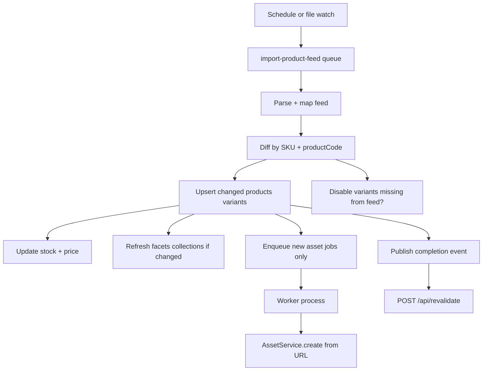

# Phase 5 — Ongoing sync and assets

Production-ready feed integration: scheduled delta updates, background asset imports, cache invalidation.

## Goals

- Re-import feed without duplicating catalog entries
- Update stock, price, enabled state on each run
- Import images asynchronously via worker
- Notify storefront to revalidate after import

## Deliverables

- [ ] Delta sync by variant SKU (`Unique ID`)
- [ ] `DefaultSchedulerPlugin` or cron-triggered import job
- [ ] Asset import job queue (remote URL → Vendure Asset)
- [ ] Skip unchanged assets (URL / etag strategy)
- [ ] `ProductFeedImportCompleted` event → optional webhook / revalidate
- [ ] Monitoring: import logs, error alerts, stale feed detection

## Delta sync architecture



## Sync rules

| Field | On re-import |
|-------|--------------|
| `RRP` | Update variant price if changed |
| `StockLevel` | Update stock on hand |
| `Stock` / OOS | Update availability |
| `Product Name`, description | Update product |
| `all_cats`, Brand, Body Fit | Replace facet assignments |
| `AllImages` | Import only new URLs |
| Missing from feed | Policy: disable variant or leave unchanged — document |

## Job queue

Create in plugin `onModuleInit()`:

```ts
this.importQueue = await this.jobQueueService.createQueue({
    name: 'import-product-feed',
    process: async job => { /* catalog sync */ },
});
```

Asset queue separately — long-running, retry-friendly.

**RequestContext in jobs:** use `ctx.serialize()` or recreate admin context in worker — never pass raw context object.

Reference: [worker-job-queue](https://github.com/vendurehq/vendure/tree/master/docs/docs/guides/developer-guide/worker-job-queue)

## Asset import strategy

| Step | Detail |
|------|--------|
| Dedupe | Store source URL on asset custom field or side table |
| Download | HTTP GET from 1on1wholesale.co.uk |
| Failure | Retry with backoff; log; product live without image |
| Variant image | Prefer URL containing `Subproduct Code` |

Consider custom `AssetImportStrategy` if Vendure defaults insufficient.

## Scheduling

Options:

1. **Fixed schedule** — e.g. nightly `0 2 * * *` via `DefaultSchedulerPlugin`
2. **Manual admin** — keep Phase 3 mutation for on-demand
3. **File watch** — if feed dropped to `data/active-products.csv` on deploy

Configure feed path via `ProductFeedImportPlugin.init({ feedPath })`.

## Storefront cache

Existing route: `apps/storefront/src/app/api/revalidate/route.ts`

After import:

- Revalidate collection layout tags
- Revalidate product slugs (batch or wildcard if supported)
- Coordinate tag names with `lib/vendure/cached.ts`

## Observability

| Metric | Purpose |
|--------|---------|
| `lastImportAt` | Settings store or custom entity |
| Row counts | created / updated / skipped / errors |
| Duration | Per run |
| Warnings | Bad groups, missing RRP |

Expose `lastProductFeedImport` on Admin API for Dashboard widget (optional).

## Acceptance criteria

- Second import run is idempotent (no duplicate SKUs)
- Stock/price changes in CSV reflect in Shop API within one sync cycle
- New products in CSV appear after scheduled run
- Asset jobs complete in worker without blocking Admin mutation
- Storefront shows updated data after revalidation

## Future extensions (out of scope)

- SFTP / HTTP feed URL instead of local file
- Promotions from `Tiered Pricing` / `Offers` tags
- B2B trade price channel
- Normalised Body Fit filter vocabulary
